# Takus — Architecture Guide

## Overview

Takus is an AI-powered screen recording studio built as a client-side PWA. All data stays in the user's browser (IndexedDB) and optional cloud storage (Google Drive / OneDrive). No server-side processing — AI calls go directly to OpenAI or Google Gemini from the browser.

**Stack**: Vanilla JS · Vite · IndexedDB · Web APIs (MediaRecorder, getDisplayMedia, PiP)

---

## Module Dependency Graph

```mermaid
graph TD
    subgraph Components
        AS[app-shell.js<br>1,318 L]
        HP[history-panel.js<br>1,164 L]
        SP[settings-panel.js<br>885 L]
        IP[insights-panel.js<br>698 L]
        TP[tasks-panel.js<br>694 L]
        RD[recording-detail.js<br>562 L]
        CP[contacts-panel.js<br>258 L]
        WM[watch-modal.js<br>197 L]
        ARN[auto-record-notification.js<br>160 L]
        ARP[auto-record-panel.js<br>157 L]
        SW[setup-wizard.js<br>196 L]
    end

    subgraph Core Libraries
        SM[state-machine.js]
        REC[recorder.js]
        ST[storage.js<br>IndexedDB v5]
        AI[ai-engine.js]
        AN[analytics.js]
    end

    subgraph Orchestration
        RP[recording-pipeline.js]
        UM[upload-manager.js]
        LIO[library-io.js]
        FF[ffmpeg-engine.js]
        KB[keyboard-manager.js]
        DD[drag-drop-handler.js]
        EB[error-boundary.js]
    end

    subgraph Intelligence
        CS[closeness-score.js]
        KL[knowledge-level.js]
        CAL[calendar-poller.js]
        ARE[auto-record-engine.js]
        EMB[embeddings.js]
    end

    subgraph Cloud
        GD[google-drive.js]
        MO[microsoft-onedrive.js]
        CPM[cloud-provider.js]
    end

    AS --> SM
    AS --> REC
    AS --> RP
    AS --> UM
    AS --> FF
    AS --> SP
    AS --> HP
    AS --> KB
    AS --> DD
    HP --> WM
    HP --> LIO
    SP --> ARP
    RP --> AI
    RP --> EMB
    RP --> ST
    UM --> FF
    AI --> ST
    CP --> CS
    CP --> KL
    CP --> ST
    ARE --> CAL
    CPM --> GD
    CPM --> MO
```



---

## Data Layer: IndexedDB v5

```
TakusDB (v5)
├── recordings      — Screen recordings metadata
│   └── Indexes: date, type, pinned
├── blobs           — Raw video Blob storage
│   └── Key: recording ID
├── embeddings      — AI transcript embeddings
│   └── Key: recording ID
├── settings        — User preferences (key-value)
├── recovery        — Crash recovery chunks
├── vaultSync       — Cloud sync state tracking
├── contacts        — People / Knowledge Source contacts
│   └── Indexes: email, closenessScore
├── interactions    — Contact interaction events
│   └── Indexes: contactId, timestamp
├── content_items  — Content with knowledge levels
│   └── Indexes: knowledgeLevel, ownerId
└── engagement_events — Engagement tracking
    └── Indexes: contentId, contactId
```

### Migration Strategy

- **Additive only**: Each version upgrade creates new stores without modifying existing ones
- **Idempotent**: `onupgradeneeded` checks `e.oldVersion` — safe to run on any previous version
- All CRUD operations in `src/lib/storage.js`

---

## Knowledge Source Levels (L0–L4)

```
L0: Owned        — User created/organized the content
L1: Involved     — User was a participant
L3: Endorsed     — From a close contact (score ≥ 65) with active engagement
L2: Contact      — From a known contact
L4: Public       — Unassociated content
```

### Closeness Score Formula

```
Score = DM×0.35 + Meetings×0.25 + SharedTasks×0.20 + Mentions×0.10 + Manual×0.10

Boosters (capped at 100):
  +5  Same organization
  +5  Interaction within 48h
  +10 Manager/report relationship
```

Close contact threshold: **≥ 65**

---

## Auto-Recording Decision Tree

```
evaluateAutoRecord(event, config):
  ✗ autoRecordEnabled == false       → SKIP
  ✗ calendar not in monitored list   → SKIP
  ✗ all-day event                    → SKIP
  ✗ cancelled or free status         → SKIP
  ✗ user is not organizer            → SKIP
  ✗ title contains exclusion keyword → SKIP
  ✗ event in suppression list        → SKIP
  ✗ active recordings ≥ max          → QUEUE
  ✓                                  → RECORD
```

---

## State Machine

```
IDLE ──────→ RECORDING ──→ REVIEWING ──→ SAVING ──→ IDLE
  ↑              │              │                      │
  │          PAUSING ←──→ RECORDING                    │
  │                                                    │
  └────────────────── IDLE ←───────────────────────────┘
```

Guards prevent invalid transitions. State history capped at 50 entries.

---

## Recording Pipeline

```
User stops recording
      │
      ▼
  Save to IDB ──→ Extract audio (FFmpeg)
      │                    │
      ▼                    ▼
  Show review       Send to AI Provider
      │              ├─ Transcribe (Whisper/Gemini)
      │              ├─ Summarize
      │              ├─ Extract tasks
      │              └─ Compute analytics
      │                    │
      ▼                    ▼
  Cloud upload      Save AI results to IDB
  (if configured)        │
      │                  ▼
      ▼             Generate embeddings
  Update UI        (for semantic search)
```

---

## Code-Split Chunks

Vite automatically code-splits these lazy-loaded modules:

| Chunk | Trigger | Size (gzip) |
|---|---|---|
| `setup-wizard.js` | First visit only | 2.6 KB |
| `auto-record-panel.js` | Settings tab | 1.6 KB |
| `contacts-panel.js` | People tab | 3.8 KB |
| `global-tasks-panel.js` | Tasks tab | 3.5 KB |
| `recording-detail.js` | Click recording | 5.4 KB |
| `qr-code.js` | Share QR button | 3.1 KB |
| `zip-export.js` | ZIP backup button | 2.0 KB |

**Main bundle**: ~94 KB gzip

---

## Security Model

1. **API keys**: Stored in IndexedDB `settings` store — never transmitted except to the AI provider
2. **Gemini API**: Uses `x-goog-api-key` header (not URL parameter)
3. **Cloud OAuth**: Tokens managed by provider SDKs; refresh handled automatically
4. **Data locality**: All recordings stay in the user's browser unless explicitly uploaded
5. **Schema validation**: `validateRecording()` and `validateContact()` guard against corruption on every IDB read

---

## Testing

```bash
npm test              # Vitest — 164 tests across 12 files
npm run build         # Production build verification
```

| Test File | Tests | Coverage |
|---|---|---|
| state-machine.test.js | 25 | Transitions, guards, history |
| analytics.test.js | 25 | Filler words, quality score, urgency |
| knowledge-levels.test.js | 23 | L0–L4 assignment, closeness scoring |
| auto-record.test.js | 21 | Decision logic, timers, edge cases |
| migration-v5.test.js | 20 | Schema upgrade, CRUD operations |
| utils.test.js | 15 | XSS escaping, markdown, VTT parsing |
| ai-engine.test.js | 8 | Task migration, VTT generation |
| keyboard-manager.test.js | 7 | Shortcuts, overlay, input suppression |
| storage.test.js | 7 | Settings get/save, recording CRUD |
| upload-manager.test.js | 6 | Retry logic, exponential backoff |
| drag-drop-handler.test.js | 4 | File validation, state guards |
| error-boundary.test.js | 4 | Suppression, truncation |

---

## File Map (70 modules)

### Components (27 files)
UI rendering and interaction handling. Each component owns its DOM subtree.

### Libraries (31 files)
Business logic, data access, and external API integration. Zero DOM dependencies.

### Tests (12 files)
Vitest + JSDOM + fake-indexeddb. Run in CI before deploy.

### Styles (7 files)
- `index.css` — Design tokens, reset, layout
- `components.css` — Core shared styles + @import aggregator (580 lines)
- `tasks.css` — Tasks, Ask, Connect, Analytics (548 lines)
- `recording-detail.css` — 70/30 split detail view (281 lines)
- `mobile.css` — Responsive breakpoints (219 lines)
- `controls.css` — Toggle switch, auto-recording (52 lines)
- `animations.css` — Keyframe animations
