# Takus — Architecture Guide

## Overview

Takus is an **Adaptive AI Knowledge OS** whose mission is *goal preservation in accordance with human well-being*. Built as a client-side PWA, it captures knowledge from recordings, documents, and user interactions, processes them with AI, and builds a knowledge graph connecting goals, tasks, people, and decisions. An autonomy engine monitors goal health, well-being signals, and preference patterns to provide gentle, non-intrusive intelligence. All data stays in the user's browser (IndexedDB) with optional cloud sync (Google Drive / OneDrive).

**Stack**: Vanilla JS · Vite · IndexedDB · Web APIs (MediaRecorder, getDisplayMedia, PiP)

---

## Module Dependency Graph

```mermaid
graph TD
    subgraph Components
        AS[app-shell.js<br>1,320 L]
        HP[history-panel.js<br>1,389 L]
        SP[settings-panel.js<br>830 L]
        IP[insights-panel.js<br>698 L]
        TP[tasks-panel.js<br>694 L]
        RD[recording-detail.js<br>887 L]
        CP[contacts-panel.js<br>258 L]
        WM[watch-modal.js<br>197 L]
        AP[archive-player.js<br>202 L]
        ARN[auto-record-notification.js<br>160 L]
        ARP[auto-record-panel.js<br>157 L]
        SW[setup-wizard.js<br>196 L]
    end

    subgraph Core Libraries
        SM[state-machine.js]
        REC[recorder.js]
        ST[storage.js<br>IndexedDB v8]
        AI[ai-engine.js]
        AN[analytics.js]
    end

    subgraph Orchestration
        RP[recording-pipeline.js]
        UM[upload-manager.js]
        LIO[library-io.js]
        FF[ffmpeg-engine.js]
        KB[keyboard-manager.js]
        DD[drag-drop-handler.js]
        EB[error-boundary.js]
    end

    subgraph Intelligence
        CS[closeness-score.js]
        KL[knowledge-level.js]
        EMB[embeddings.js]
        CW[closeness-worker.js]
        MP[meeting-prep.js]
        DD_[daily-digest.js]
        TPR[task-priority.js]
        PE[preference-engine.js]
        BSD[blind-spot-detector.js]
        FF_[feature-flags.js]
        ARR[auto-read-rules.js]
        DA[document-adapter.js]
    end

    subgraph "Goal Preservation"
        GL[goals/index.js]
        GLK[goal-linker.js]
        WB[wellbeing.js]
    end

    subgraph Flagged["Feature-Flagged (Settings → Labs)"]
        CAL[calendar-poller.js]
        ARE[auto-record-engine.js]
    end

    subgraph Autonomy
        AE[autonomy-engine.js]
        SE[step-executor.js]
        NM[notification-manager.js]
        CB[command-bar.js]
    end

    subgraph Cloud
        GD[google-drive.js]
        MO[microsoft-onedrive.js]
        CPM[cloud-provider.js]
    end

    AS --> SM
    AS --> REC
    AS --> RP
    AS --> UM
    AS --> FF
    AS --> SP
    AS --> HP
    AS --> KB
    AS --> DD
    HP --> WM
    HP --> LIO
    SP --> ARP
    RP --> AI
    RP --> EMB
    RP --> ARR
    RP --> DA
    RP --> ST
    UM --> FF
    AI --> ST
    CP --> CS
    CP --> KL
    CP --> ST
    CW --> CS
    CW --> KL
    CW --> ST
    HP --> AP
    ARE -.- CAL
    style ARE stroke-dasharray: 5 5
    style CAL stroke-dasharray: 5 5
    AE --> SE
    NM -.->|"CustomEvent<br/>NOTIFY"| AS
    CPM --> GD
    CPM --> MO
    MP --> CS
    MP --> KL
    MP --> ST
    DD_ --> ST
    DD_ --> AN
    TPR --> CS
    IP --> DD_
    IP --> MP
    IP --> TPR
    AS --> AE
    AE --> EMB
    AE --> ST
    AE --> NM
    AE --> CW
    CB --> ST
    TPR --> PE
    AI --> PE
    AI --> FF_
    AI --> ST
    IP --> BSD
    AE --> GL
    AE --> GLK
    AE --> WB
    GL --> ST
    GLK --> ST
    WB --> ST
    RP --> GL
```



---

## Mission-Critical Layers

### Goal Preservation Engine

The core intelligence loop that gives Takus its mission identity:

```
Content Source (recording, document, manual) 
       │
       ▼
  AI Goal Extraction (ai-engine.js → extractGoals)
       │
       ├── New goal? → Create node (aspiration)
       └── Existing goal? → Bump mentionCount, add evidence
       │
       ▼
  Goal Health Monitor (autonomy-engine → _autoGoalHealth)
       │
       ├── Active + stagnating? → Flag as at-risk
       └── Recently mentioned? → Keep active
       │
       ▼
  Task→Goal Linking (autonomy-engine → _autoGoalTaskLinking)
       │
       └── autoLinkTasks() creates CONTRIBUTES_TO edges
       │
       ▼
  Progress Tracking (goal-linker.js → computeGoalProgress)
       │
       └── Progress % surfaced on goal cards
```

**Key modules:** `goals/index.js`, `goal-linker.js`, `ai-engine.js` (extractGoals)

### Well-being Service

Monitors user state and provides gentle, non-intrusive nudges:

- **Session duration**: Tracks continuous work time, suggests breaks
- **Task load**: Flags overload when pending tasks exceed threshold
- **Meeting fatigue**: Analyzes recent meeting density
- **Focus capacity**: Composite score (high/medium/low) from all signals

**Key module:** `wellbeing.js` — pure logic layer, no side effects. Called by `autonomy-engine.js` every 30s with goals, tasks, and recordings.

### Adaptive Intelligence

A local reinforcement-learning layer that adapts AI behavior to user patterns:

```
User Action (accept/ignore/edit task, activate/achieve goal)
       │
       ▼
  recordSignal() → preference-engine.js (IDB signals store)
       │
       ├── getPromptPreferences() → _buildAdaptiveHint() → AI prompt modifier
       └── getScoringAdjustments() → task-priority.js → score weights
```

**10 signal types:** `TASK_ACCEPTED`, `TASK_IGNORED`, `TASK_EDITED`, `SEARCH_CLICKED`, `SEARCH_REFINED`, `SUMMARY_EDITED`, `PRIORITY_OVERRIDE`, `GOAL_ACTIVATED`, `GOAL_ACHIEVED`, `GOAL_ABANDONED`

**Blind Spot Detection** (`blind-spot-detector.js`): 4 bias patterns analyzed from user behavior — ignored categories, single-source tunnel vision, stale contacts, recency bias. Advisory only; never overrides user decisions.

---

## Data Layer: IndexedDB v8

```
TakusDB (v8)
├── recordings      — Content metadata (recordings, documents, imports)
│   └── Indexes: date
├── blobs           — Raw video Blob storage
│   └── Key: recording ID
├── embeddings      — AI transcript embeddings
│   └── Key: recording ID
├── settings        — User preferences (key-value)
├── recovery        — Crash recovery chunks
├── vaultSync       — Cloud sync state tracking
├── wiki            — Living wiki entries
│   └── Indexes: date
├── contacts        — People / Knowledge Source contacts
│   └── Indexes: email, closenessScore
├── interactions    — Contact interaction events
│   └── Indexes: contactId, timestamp
├── content_items  — Content with knowledge levels
│   └── Indexes: knowledgeLevel, ownerId
├── engagement_events — Engagement tracking
│   └── Indexes: contentId, contactId
├── edges          — Knowledge graph edges
│   └── Indexes: sourceKey (compound), targetKey (compound), edgeType
├── nodes          — Graph nodes (goals, tasks, content)
│   └── Indexes: type, appId
└── step_checkpoints — Step executor crash recovery (v7)
    └── Key: step ID
```

### Migration Strategy

- **Additive only**: Each version upgrade creates new stores without modifying existing ones
- **Idempotent**: `onupgradeneeded` checks `e.oldVersion` — safe to run on any previous version
- All CRUD operations in `src/lib/storage.js`

---

## Knowledge Source Levels (L0–L4)

```
L0: Owned        — User created/organized the content
L1: Involved     — User was a participant
L3: Surfaced     — From a close contact (score ≥ 65) with active engagement
L2: Contact      — From a known contact
L4: Public       — Unassociated content
```

### Closeness Score Formula

```
Score = DM×0.35 + Meetings×0.25 + SharedTasks×0.20 + Mentions×0.10 + Manual×0.10

Boosters (capped at 100):
  +5  Same organization
  +5  Interaction within 48h
  +10 Manager/report relationship
```

Close contact threshold: **≥ 65**

---

## Auto-Recording Decision Tree

```
evaluateAutoRecord(event, config):
  ✗ autoRecordEnabled == false       → SKIP
  ✗ calendar not in monitored list   → SKIP
  ✗ all-day event                    → SKIP
  ✗ cancelled or free status         → SKIP
  ✗ user is not organizer            → SKIP
  ✗ title contains exclusion keyword → SKIP
  ✗ event in suppression list        → SKIP
  ✗ active recordings ≥ max          → QUEUE
  ✓                                  → RECORD
```

---

## State Machine

```
IDLE ──────→ RECORDING ──→ REVIEWING ──→ SAVING ──→ IDLE
  ↑              │              │                      │
  │          PAUSING ←──→ RECORDING                    │
  │                                                    │
  └────────────────── IDLE ←───────────────────────────┘
```

Guards prevent invalid transitions. State history capped at 50 entries.

---

## Recording Pipeline

```
User stops recording
      │
      ▼
  Save to IDB ──→ Extract audio (FFmpeg)
      │                    │
      ▼                    ▼
  Show review       Send to AI Provider
      │              ├─ Transcribe (Whisper/Gemini)
      │              ├─ Summarize
      │              ├─ Extract tasks
      │              └─ Compute analytics
      │                    │
      ▼                    ▼
  Cloud upload      Save AI results to IDB
  (if configured)        │
      │                  ▼
      ▼             Generate embeddings
  Update UI        (for semantic search)
```

---

## Code-Split Chunks

Vite automatically code-splits these lazy-loaded modules:

| Chunk | Trigger | Size (gzip) |
|---|---|---|
| `setup-wizard.js` | First visit only | 2.6 KB |
| `auto-record-panel.js` | Settings tab | 1.6 KB |
| `contacts-panel.js` | People tab | 3.8 KB |
| `global-tasks-panel.js` | Tasks tab | 7.7 KB |
| `recording-detail.js` | Click recording | 9.0 KB |
| `qr-code.js` | Share QR button | 3.1 KB |
| `app-manager.js` | App ecosystem | 3.1 KB |
| `registry.js` | App registration | 7.3 KB |

**Main bundle**: ~150 KB gzip (574 KB uncompressed)

---

## Security Model

1. **API keys**: Stored in IndexedDB `settings` store — never transmitted except to the AI provider
2. **Gemini API**: Uses `x-goog-api-key` header (not URL parameter)
3. **Cloud OAuth**: Tokens managed by provider SDKs; refresh handled automatically
4. **Data locality**: All recordings stay in the user's browser unless explicitly uploaded
5. **Schema validation**: `validateRecording()` and `validateContact()` guard against corruption on every IDB read

---

## Testing

```bash
npm test              # Vitest — 1,145 tests across 74 files
npm run build         # Production build verification
```

Key test files:

| Test File | Tests | Coverage |
|---|---|---|
| state-machine.test.js | 25 | Transitions, guards, history |
| analytics.test.js | 25 | Filler words, quality score, urgency |
| knowledge-levels.test.js | 23 | L0–L4 assignment, closeness scoring |
| auto-record.test.js | 21 | Decision logic, timers, edge cases |
| archive-engine.test.js | 21 | Archive lifecycle, condensation |
| migration-v5.test.js | 20 | Schema upgrade, CRUD operations |
| search-engine.test.js | 18 | Full-text and semantic search |
| task-priority.test.js | 18 | Priority scoring, preference adjustments |
| closeness-score.test.js | 16 | Interaction weights, boosters |
| knowledge-level.test.js | 16 | L0–L4 classification |
| goals.test.js | 15 | Goal lifecycle, analytics, signals |
| recording-templates.test.js | 13 | Template CRUD, auto-run presets |
| ai-engine.test.js | 10 | Task migration, goal extraction |
| autonomy-engine.test.js | 9 | Start/stop, stats, goal linking |
| vector-utils.test.js | 12 | Mean/average embedding computation |
| wellbeing.test.js | 36 | Session, breaks, goal/task/meeting health |

---

## File Map (132 source modules)

### Components (35 files)
UI rendering and interaction handling. Each component owns its DOM subtree.

### Libraries (84 files including graph utilities and 5 integrations)
Business logic, data access, autonomy, and external API integration. Zero DOM dependencies.
All lib/ modules communicate to the UI via DOM events — never by importing components directly.

### Apps (12 files)
App ecosystem modules (goals, tasks, recorder, etc.) registered via the app-manager.

### Tests (74 files)
Vitest + JSDOM + fake-indexeddb. Run in CI before deploy.

### Styles (7 files)
- `index.css` — Design tokens, reset, layout
- `components.css` — Core shared styles + @import aggregator (580 lines)
- `tasks.css` — Tasks, Ask, Connect, Analytics (548 lines)
- `recording-detail.css` — 70/30 split detail view (281 lines)
- `mobile.css` — Responsive breakpoints (219 lines)
- `controls.css` — Toggle switch, auto-recording (52 lines)
- `animations.css` — Keyframe animations
